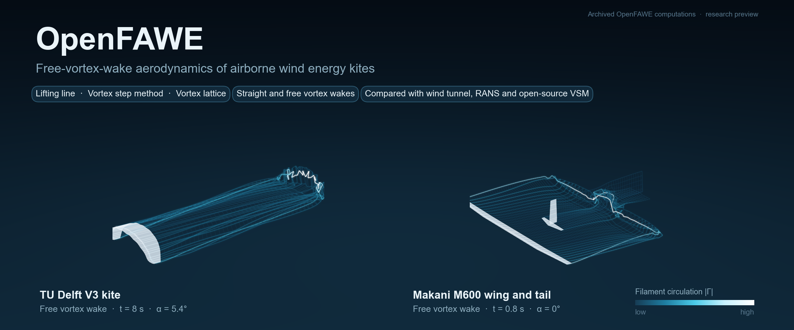

  

  
  
  

# OpenFAWE

Aerodynamic simulation of airborne wind energy kites — research preview.

> **Status.** OpenFAWE is independent research carried out and funded by the author.
> The source code is not public yet. It will be released progressively after the related
> journal papers are published, and more features will be added over time. This repository
> currently provides a method comparison report and a Windows research-preview program.

## Results at a glance

  

TU Delft V3 kite: eight OpenFAWE method combinations compared with wind-tunnel measurements
(Poland et al., 2026), RANS results (Viré et al., 2020) and the open-source vortex-step-method
code (Cayon et al., 2023).

- The open-source VSM code, run with the same input, reproduces OpenFAWE VSM: lift within 0.3%,
  drag within 0.9%.
- At 5.4° and 7.4° the lift of the polar-coupled methods is within −12% to +5% of the wind tunnel.
  The low-angle lift and the pitching moment differ from the measurements for all codes,
  including RANS and the open-source VSM; this is still being studied.
- For the Makani M600, the straight-wake methods are within −1.6% to +0.8% of the open-source
  VSM lift ([Figure 2](docs/figures/Fig2_M600_methods_vs_public_VSM_600dpi.png)). The effect of a
  fuselage is shown separately and is not a validation ([Figure 3](docs/figures/Fig3_M600_fuselage_effect_600dpi.png)).

Full details, limitations and references: **[method comparison report](docs/comparison-report.md)**.

## OpenFAWE Wake Viewer (Windows)

Choose a model (V3 kite or M600), a wind speed and a simulated time; the program computes the
free vortex wake and replays it. Download it from
[Releases](https://github.com/robytian/OpenFAWE/releases).

1. Download `OpenFAWE-WakeViewer-0.1.0-win64.zip` and check its SHA-256 against the value on the
   release page.
2. Unzip it and run `OpenFAWE-WakeViewer.exe`. The program is not code-signed, so Windows may show
   "Windows protected your PC"; choose "More info" and then "Run anyway".
3. Choose the model, wind speed and simulated time, then click **Run and view wake**.
   Runs are saved in `%USERPROFILE%\OpenFAWE-WakeViewer\runs`.

What this preview does not do: the angle of attack is fixed per model; only the lifting-line
free-wake method is offered; section polars are fixed (no Reynolds-number correction); at most
80 time steps are computed; there is no tether, control or power model. The results are
research output and are not validated for design use.

## Methods in brief

Eight aerodynamic method combinations: lifting line (LL), vortex step method (VSM;
Cayon et al., 2023), inviscid vortex-lattice lifting surface (LS) and polar-coupled LS, each
with a prescribed straight wake or a free vortex wake. The free-wake formulation is derived
from OpenFAST/OLAF (Branlard et al., 2022). The wake images above are archived 40-step
free-wake states from an impulsive start; they illustrate the method and are not a
convergence result.

## Licence

Copyright (c) 2026 Yinong Tian. All rights reserved; see [LICENSE.md](LICENSE.md).
Third-party components remain under their own licences; see
[THIRD_PARTY_NOTICES.md](THIRD_PARTY_NOTICES.md).

Questions and bug reports: please open an issue.

## 中文说明

OpenFAWE 是作者自费开展的独立研究，用于空中风能风筝的气动仿真。源代码暂不公开，将在相关期刊论文发表后逐步开源，后续会补充更多功能。本仓库目前提供方法对比报告和一个 Windows 研究预览程序（可选择模型、风速和仿真时间，计算并回放自由尾迹），程序请在 Releases 下载。计算结果为研究结果，不能用于设计。
