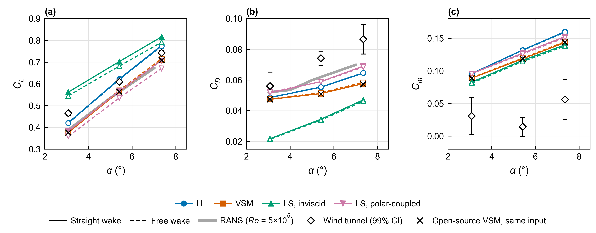
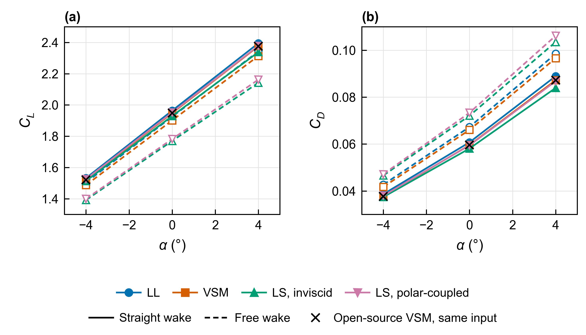
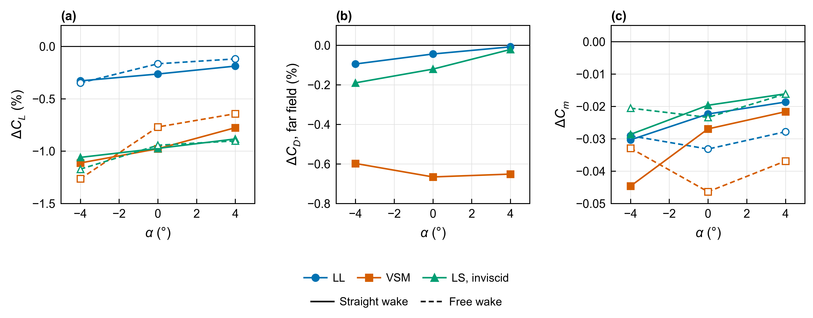

# OpenFAWE method comparison: TU Delft V3 kite and Makani M600

Preview report, 1 October 2026. Author: Yinong Tian. Independent, self-funded research.

This report compares the current OpenFAWE aerodynamic methods with public results. Figures 1
and 2 are verification and validation comparisons. Figure 3 shows the effect of adding a
fuselage to the M600; it is not a validation, because none of the public references includes
a fuselage.

## 1. Methods compared

| Label | Method | Wake | Section polars |
|---|---|---|---|
| LL | Lifting line, section angle at the quarter chord | straight or free | used |
| VSM | Vortex step method (Cayon et al., 2023), closure at the three-quarter chord | straight or free | used |
| LS, inviscid | Vortex-lattice lifting surface, 8 cosine-spaced chordwise panels, thin inviscid surface | straight or free | not used |
| LS, polar-coupled | The same lattice coupled to the section polars | straight or free | used |

Straight wake: prescribed straight trailing wake, steady solution. Free wake: time-marching
free vortex wake from an impulsive start, Euler convection, constant vortex core of 0.15 m,
derived from OpenFAST/OLAF (Branlard et al., 2022). All eight combinations were recomputed
with the same program version on 29 September 2026.

## 2. Public references

| Reference | Case | Used for |
|---|---|---|
| Wind-tunnel measurements on a rigid scale model of the V3 kite (Poland et al., 2026), 99% confidence intervals | V3, *Re* = 5×10⁵ | validation |
| RANS simulations, *Re* = 5×10⁵, without struts (Viré et al., 2020, as corrected in the TU Delft V3 kite data repository) | V3 | comparison with an independent solver |
| Open-source VSM code (Cayon et al., 2023), run with the same geometry and section polars | V3 and M600 | code-to-code verification |

## 3. Results

### 3.1 TU Delft V3 kite

**Figure 1.** TU Delft V3 kite: (a) lift, (b) drag and (c) pitching-moment coefficients of the
eight OpenFAWE method combinations, compared with the wind-tunnel measurements of
Poland et al. (2026; error bars: 99% confidence interval), the RANS results of Viré et al.
(2020) at *Re* = 5×10⁵, and the open-source VSM code of Cayon et al. (2023) run with the same
geometry, section polars and aerodynamic-centre load-angle option. *C*m is taken about the
reference point used by Poland et al.; no RANS moments are available. Filled symbols and solid
lines: prescribed straight wake; open symbols and dashed lines: free wake (value at *t* = 8 s,
40 steps). The drag of the inviscid LS is induced drag only.

Main observations:

- **Code-to-code.** The open-source VSM code, run with the same input and option, gives the
  same result as OpenFAWE VSM: *C*L within 0.3%, *C*D within 0.9% and *C*m within 0.0003.
  With the code's default control-point load-angle option, *C*L changes by less than 0.2% and
  *C*D is 11–33% higher, so the VSM drag depends on this modelling option.
- **Independent RANS.** VSM and the polar-coupled LS are within −8% to +3% of the RANS lift;
  LL is 8–12% higher. The polar-coupled LS drag is within 5% of the RANS drag; LL and VSM are
  7–19% lower.
- **Wind tunnel.** At 5.4° and 7.4°, the lift of the polar-coupled methods is within −12% to
  +5% of the measurements; at 3.1° it is 9–23% lower. The RANS lift shows a similar deficit
  (about 16% at 3.1° and 7% at 5.4°), and the measured drag is 8–22% above the RANS drag. All
  methods, including the open-source VSM code, give a pitching moment 0.05–0.12 higher than
  measured. Since independent codes share these differences, they appear to come from
  differences between the tested and the simulated configurations; the cause is still under
  study, and no parameter was tuned to match the measurements.
- The inviscid LS contains no section viscous drag and no viscous lift loss; for this
  leading-edge-inflatable kite its drag is 46–62% below the measurements.

### 3.2 Makani M600

**Figure 2.** Makani M600 wing and tail (reconstructed geometry, no fuselage) at *U* = 20 m/s:
(a) lift and (b) drag coefficients of the eight OpenFAWE method combinations, compared with the
open-source VSM code of Cayon et al. (2023) run with the same geometry and section polars. The
section polars are ideal thin-airfoil polars without profile drag, so *C*D is induced drag only.
No wind-tunnel data matching this configuration are available. Free-wake values at
*t* = 0.8 s (40 steps) are not time-converged.

- OpenFAWE VSM reproduces the open-source VSM code to within 10⁻⁹.
- The straight-wake methods are within −1.6% to +0.8% of the open-source VSM lift.
- With a free wake, LL and VSM are 1–3% lower and the free-wake LS is 8–10% lower; time and
  wake-length convergence of the free-wake results is still being studied.
- The drag shown is induced drag only and is not a drag validation; profile and parasitic drag
  of the real aircraft are not modelled here.

### 3.3 Effect of a fuselage (not a validation)

**Figure 3.** Effect of the fuselage on the Makani M600 coefficients. The fuselage is a
closed, non-penetrating constant-source panel body (Hess and Smith, 1967; 560 panels) coupled
to each method. Shown are the changes relative to the same method without fuselage: (a) *C*L in
per cent, (b) far-field (Trefftz-plane) induced drag in per cent, available for straight wakes
only, and (c) *C*m about the origin. Without the fuselage, OpenFAWE VSM equals the open-source
VSM code, so the VSM curves are also the deviation from that public reference.

- The fuselage lowers *C*L by 0.1–1.3% and changes the far-field induced drag by less than
  0.7%. These are close to the results without fuselage.
- The pitching moment becomes more nose-down by 0.016–0.046. This is a genuine configuration
  effect; it is stable under panel refinement and vortex-core changes.
- Near-field drag is not reported: the pressure integral over the isolated fuselage keeps a
  spurious drag of about 0.002 that does not converge with refinement.

## 4. Limitations and open questions

- The difference in low-angle lift and in pitching moment between the V3 measurements and all
  simulations (including RANS and the open-source VSM) is open.
- VSM drag depends on the load-angle option by up to about 30%.
- Free-wake results are single-resolution snapshots; time-step and wake-length convergence is
  in progress.
- The M600 case has no profile or parasitic drag and no matched experiment.
- The results have not yet been reviewed in a journal.

## References

- Branlard, E., et al. (2022). *Wind Energy Science* 7, 455. doi:[10.5194/wes-7-455-2022](https://doi.org/10.5194/wes-7-455-2022)
- Cayon, O., Gaunaa, M., Schmehl, R. (2023). *Energies* 16(7), 3061. doi:[10.3390/en16073061](https://doi.org/10.3390/en16073061). Code: [awegroup/Vortex-Step-Method](https://github.com/awegroup/Vortex-Step-Method)
- Hess, J. L., Smith, A. M. O. (1967). *Progress in Aerospace Sciences* 8, 1–138.
- Poland, J. A. W., et al. (2026). *Wind Energy Science* 11, 911. doi:[10.5194/wes-11-911-2026](https://doi.org/10.5194/wes-11-911-2026). Data: doi:[10.5281/zenodo.14288467](https://doi.org/10.5281/zenodo.14288467)
- Viré, A., et al. (2020). RANS simulations of the V3 kite, as corrected and distributed in the TU Delft V3 kite data repository, file `CFD_RANS_Re5e5_alpha_sweep_beta_0_Vire2020_CorrectedByPoland2025.csv`: [awegroup/TUDELFT_V3_KITE](https://github.com/awegroup/TUDELFT_V3_KITE)
- Makani Technologies LLC. M600 public data: [google/makani](https://github.com/google/makani) (Apache-2.0).
